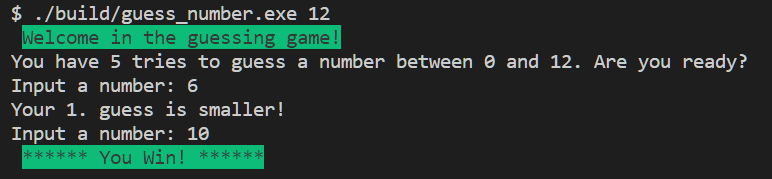
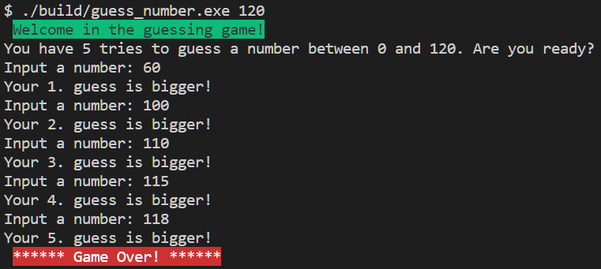

# c_40_guess_number

## DESCRIPTION

In this program I implemented a simple guessing game. The player sets a range within he wants to guess the number, then he has 5 tries to find the number. The program generates a random number between 0 and a number the user set at start as a command-line argument.

Here are a few examples of how the program should work. For example, if the player omits a command-line argument entirely:

```bash
./guess_number
Usage: ./guess_number range_size
```

If the player instead does provide a command-line argument, but it’s not in the correct range:

```bash
./guess_number 0
Error: range_size must be between 0 and 30000! 
```

If the player does provide a command-line argument, but it’s not a number:

```bash
./guess_number ten
Error: range_size must be a number! 
```

Here is an example when the player wins the game:



And when player lose:



### SPECIFICATION

- The program should accept a single command-line argument. If the program was not run with a single command-line argument, you should print an error message as demonstrated above and `return 1`, ending the program.
- If the command-line argument is not a number print an error message, and `return 1`.
- Convert the command-line argument `string` to `integer` number.
- Print out the range within the player can guess.
- The player can have five guesses within he must find the number, otherwise he loses.
- Help the player if the number he guessed is higher or lower than the generated number.
- Check if the player inputs correct type of number, if his input contains other types than a number, ask for a new guess.
- When the player wins print "You win!" with green background, if looses print "Game Over!" with red background.

### EXAMPLES

```bash
./guess_number 10
Welcome in the guessing game!
You have 5 tries to guess a number between 0 and 10. Are you ready?
Input a number: 5
Your 1. guess is bigger! 
Input a number: 3
Your 2. guess is bigger!
Input a number: 1
Your 3. guess is smaller!
Input a number: 2
****** You Win! ******

./guess_number 100
Guess a number between 0 and 10. Are you ready?
Your first guess: 50
The number is < then 50
Your second guess: 13
The number is > then 13
Your third guess: 38
The number is > then 38
Your fourth guess: 45
The number is < then 45
Your fifth guess: 40
****** Game Over! ******
```

## INSTALL LIBRARIES

The source code uses the cs50 library what you can download [HERE](https://github.com/cs50/libcs50).

To install the cs50 library follow the steps:

1. Open git bash terminal and change the current working directory to `src`:  
   > cd ./libsc50/src

2. Compile the cs50.c source into .o with:
   > gcc -c cs50.c -o cs50.o

3. Make the library archive:  
   > ar rcs libcs50.a cs50.o

4. Copy the `libcs50.a` file into your compiler's `lib` directory

5. Copy the `cs50.h` file into your compiler's `include` directory

## COMPILE AND RUN THE CODE

The code is written in C, the compiler used to generate the exe is: `gcc Rev10, Built by MSYS2 project 12.2.0`

Run the below code in terminal (git bash) to compile the source:

> gcc commandLineArgument.c -lcs50 -o ./build/commandLineArgument

To run the executable run the below code in terminal (git bash):

> ./build/commandLineArgument.exe
